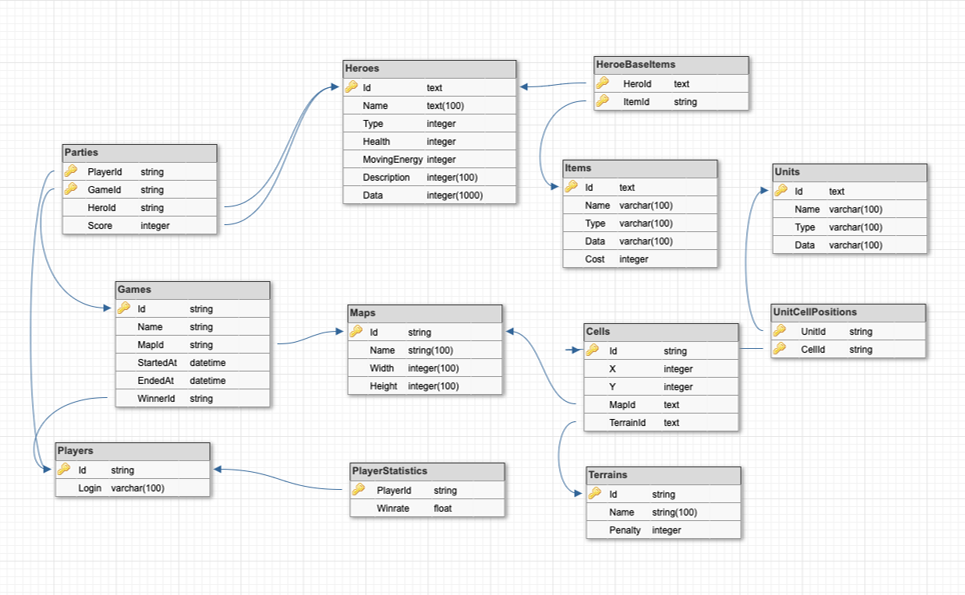

# WpfRpg

Проект, надо которым я работал на курсах Veeam Academy.

## Архитектура

## Сервисы
* AuthService – Отвечает за авторизацию и аутентификацию пользователя
* MainService – Используется в качестве поставщика данных и является proxy сервисом, при общении с другими
* GameSrervice – является хостом игр пользователей. Технология WCF – tcp для надежности и быстрой скорости передачи.

## Структура базы данных

В проекте используются технологии ADO.NET и EF6